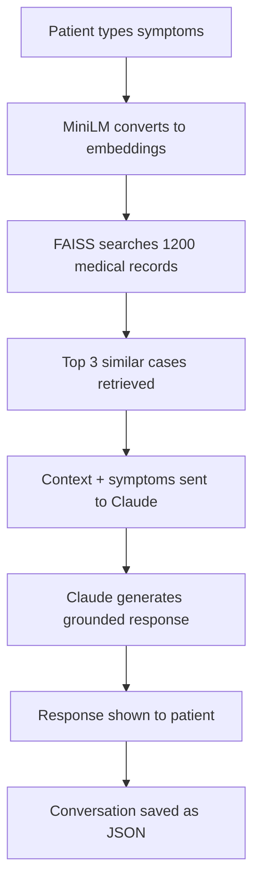

# 🏥 AI Healthcare Chatbot

An AI-powered healthcare chatbot built with the Anthropic Claude API and RAG 
(Retrieval Augmented Generation). Simulates a friendly medical assistant that 
retrieves relevant medical information before responding, reducing hallucination 
risk in a high-stakes domain.

## Features
- RAG-based retrieval from symptoms2diseases medical dataset (1,200 records)
- Multi-turn conversation with memory
- Unique Patient ID generation per session
- Saves every consultation as a JSON file
- Gradio web interface with public URL
- Always reminds users to consult a real doctor

## Tech Stack
- Python
- Anthropic Claude API (claude-opus-4-6)
- Sentence Transformers (all-MiniLM-L6-v2)
- FAISS vector search
- Gradio
- Google Colab

## Architecture

## How to Run
1. Clone this repository
2. Open in Google Colab
3. Install dependencies:
   pip install anthropic sentence-transformers faiss-cpu gradio datasets
4. Add your Anthropic API key
5. Run all cells
6. Use the Gradio public URL to access the app

## Dataset
Uses the symptoms2diseases dataset from Hugging Face — 
1,200 patient symptom descriptions across 24 disease categories.

## Important Disclaimer
This is an AI assistant and NOT a substitute for professional medical advice.
Always consult a qualified healthcare provider for proper diagnosis and treatment.

## Author
Disha Agarwal
